<div align="center">

# AI Builder Skills Pack

### Evidence-first engineering skills for Cursor, Codex and Claude Code

Reusable workflows that make your coding agent inspect the real project, verify its claims and report what it could not check: security, debugging, Next.js, Supabase, RAG, Blender and more.

[](https://github.com/saksham-techlabs/ai-builder-skills-pack/actions/workflows/ci.yml)
[](LICENSE)
[](package.json)
[](tsconfig.json)
[](package.json)

**14 skills · Cursor, Codex, Claude Code + generic preset · Safe local installer · MIT**

</div>

---

## What it does in one example

> **“Use security-auditor to inspect auth, authorization, secrets, APIs and Supabase RLS.”**

Instead of a generic list of possible vulnerabilities, the skill directs the agent to map trust boundaries, trace identity and resource access in your actual code, confirm each finding with a file and line, and keep unknowns separate. For example, live RLS state can't be confirmed from migrations alone, and missing access is never reported as a clean result.



<sub>Step 1 shows real CLI output. Step 3 is an <b>illustrative example</b> of the report format the skill requires, not the result of a real audit.</sub>

## Quick start

Requires **Node.js 22+** and npm.

```sh
git clone https://github.com/saksham-techlabs/ai-builder-skills-pack.git
cd ai-builder-skills-pack
npm ci

# Pick skills interactively for your app
npm run cli -- init --target "../my-app"

# …or install directly
npm run cli -- install security-auditor --preset cursor --target "../my-app"
```

Your app receives plain Markdown files plus an installation receipt. It gets no npm dependencies and no config edits.

> **Not on npm yet.** The intended package name is `ai-builder-skills`, but it has not been published. Don't run `npx ai-builder-skills` until a verified release exists; it may fail or resolve an unrelated package.

## Skills

| Skill | Best for | What the agent does |
| --- | --- | --- |
| 🔐 [`security-auditor`](skills/security-auditor/SKILL.md) | Security reviews, pre-release audits | Audits trust boundaries; reports only evidence-backed findings with prioritized, testable fixes |
| 🐞 [`debugging-expert`](skills/debugging-expert/SKILL.md) | Runtime failures, intermittent bugs | Reproduce → trace → root cause → minimal fix with a regression check |
| 🔍 [`code-reviewer`](skills/code-reviewer/SKILL.md) | Pull requests, change reviews | Reviews a concrete diff for correctness, security and compatibility regressions |
| 🧩 [`frontend-expert`](skills/frontend-expert/SKILL.md) | UI implementation, interaction bugs | Reuses your component system, with accessible states and real browser evidence |
| ▲ [`nextjs-expert`](skills/nextjs-expert/SKILL.md) | Routing, rendering and caching issues | Works against the **installed** Next.js version, not memory |
| 🎨 [`ui-ux-reviewer`](skills/ui-ux-reviewer/SKILL.md) | Interface reviews, user journeys | Separates observed usability/accessibility friction from preference |
| ⚡ [`performance-optimizer`](skills/performance-optimizer/SKILL.md) | Slow apps, resource usage | Finds measured bottlenecks; validates fixes under comparable workloads |
| 🏗️ [`backend-architect`](skills/backend-architect/SKILL.md) | Service design, backend evolution | Service boundaries, durable jobs and failure handling from real constraints |
| 🔌 [`api-designer`](skills/api-designer/SKILL.md) | API design, integration contracts | Explicit validation, resource authorization, compatibility and retry semantics |
| 🗄️ [`database-optimizer`](skills/database-optimizer/SKILL.md) | Slow queries, schema performance | Requires query plans and workload shape before recommending indexes |
| 🟩 [`supabase-expert`](skills/supabase-expert/SKILL.md) | Supabase apps, tenant isolation | Auth, RLS policies, Storage and server clients with explicit isolation |
| 🏢 [`saas-architect`](skills/saas-architect/SKILL.md) | SaaS planning, multi-tenant systems | Isolation, entitlements, billing state and operating-cost assumptions |
| 🧠 [`ai-rag-engineer`](skills/ai-rag-engineer/SKILL.md) | Document Q&A, AI knowledge features | Retrieval with access filtering, provenance, evaluation and cost controls |
| 🧊 [`blender-3d-expert`](skills/blender-3d-expert/SKILL.md) | Blender scenes, web 3D assets | Editable scenes, real scale and measured web-export budgets |

Each skill folder contains `SKILL.md` (the workflow), `CHECKLIST.md` (coverage tracking) and `EXAMPLES.md` (request patterns). The examples describe procedures; they never pretend an imaginary project was audited.

## Why use this instead of writing prompts manually?

| Ad-hoc prompt | Skill |
| --- | --- |
| Rewritten each time; quality depends on memory | Same reviewed workflow every run, versioned in `skills.json` |
| “Check security” → agent guesses what matters | Explicit steps: authN, authZ/IDOR, secrets, injection, RLS, rate limits, CSRF/CORS |
| Agent may report plausible but unverified issues | Decision rules: a finding needs code evidence and an attack path; hypotheses are labeled |
| “Looks good” when the agent couldn't actually check | Required split: confirmed / needs evidence / no issue observed / **not run** |
| No clear finish line | Definition of done plus a structured, prioritized output format |

A skill doesn't make an agent infallible. It encodes the decisions that matter, so a review or fix is repeatable and its gaps are visible.

## Use with your agent

| Preset | Installs to | Flag |
| --- | --- | --- |
| Cursor | `.cursor/skills/<id>/` | `--preset cursor` |
| Codex | `.agents/skills/<id>/` | `--preset codex` |
| Claude Code | `.claude/skills/<id>/` | `--preset claude` |
| Generic | `.ai-builder/skills/<id>/` | `--preset generic` (default) |

### Cursor

```sh
npm run cli -- install frontend-expert --preset cursor --target "../my-app"
```

In Cursor chat, attach `.cursor/skills/frontend-expert/SKILL.md` and ask:

> Use this skill to fix the settings form's loading and error states. Reuse our existing components and verify keyboard behavior.

[Full Cursor example →](examples/cursor-example/README.md)

### Codex

```sh
npm run cli -- install security-auditor --preset codex --target "../my-app"
```

> Read .agents/skills/security-auditor/SKILL.md and audit authentication and organization access. Report confirmed findings separately from unknowns. Do not make code changes in this audit.

[Full Codex example →](examples/codex-example/README.md)

### Claude Code

```sh
npm run cli -- install debugging-expert --preset claude --target "../my-app"
```

> Read .claude/skills/debugging-expert/SKILL.md. Reproduce the duplicate submission bug, trace the root cause and implement the smallest safe fix. State exactly which checks ran.

### Any other agent (no CLI needed)

Open `skills/<id>/SKILL.md`, paste or attach it with your task, and ask the agent to inspect the real project and disclose checks it could not run. Keep the three files together so relative links work. [Generic example →](examples/generic-example/README.md)

Presets are conservative file copies, not plugins or permission grants. Paths follow the official [Cursor](https://cursor.com/docs/skills), [Codex](https://developers.openai.com/codex/skills/) and [Claude Code](https://code.claude.com/docs/en/skills) skills documentation (checked October 5, 2026). Discovery behavior can change between tool versions; explicitly loading `SKILL.md` always works as a fallback.

## CLI

```sh
npm run cli -- list                                                    # available skills
npm run cli -- init --target "../my-app"                               # interactive picker
npm run cli -- install security-auditor --target "../my-app"           # generic preset
npm run cli -- install frontend-expert nextjs-expert --preset cursor --target "../my-app"
npm run cli -- install --all --preset claude --target "../my-app"
npm run cli -- installed --target "../my-app"                          # versions + edit status
npm run cli -- remove security-auditor --target "../my-app"
```

| Command / option | Behavior |
| --- | --- |
| `init` | Interactive preset and multi-skill selection; accepts explicit IDs/options for automation |
| `list` | Available skills from `skills.json` |
| `install <id...>` | Copy selected skills; `--all` installs the catalog |
| `installed` | Owned installations, versions and edit status; scans all presets by default |
| `remove <id...>` | Remove named, owned skills; detects the preset or asks for `--preset` if ambiguous |
| `help`, `--help`, `-h` | Usage and options |
| `--preset <name>` | `generic`, `cursor`, `codex` or `claude`; `install` defaults to `generic` |
| `--target <path>` | Target project; defaults to the directory you ran the command from |
| `--force` | Replace a managed installation or discard modified owned files during removal |

Noninteractive installation requires IDs or `--all`. Unknown flags, unknown IDs and missing arguments exit nonzero.

### Your files stay yours

- Existing skills are **never overwritten by default**. `--force` replaces only a valid managed installation (back up local edits first).
- Unknown directories, extra files and symbolic links are refused, even with `--force`.
- Each install writes the three canonical files, a generated `USAGE.md` and an `.ai-builder-install.json` receipt with file hashes.
- No agent settings, `AGENTS.md`, `CLAUDE.md`, dependencies or routes are edited.
- Batches are not transactional. See [failure and recovery](docs/architecture.md#failure-and-recovery).

## How it works


1. **Discover:** read real project instructions, versions, code and tool availability.
2. **Decide:** choose a workflow using explicit evidence and domain-specific decision rules.
3. **Verify:** run relevant checks when available; separate facts, hypotheses and missing access.
4. **Report:** produce prioritized, actionable output with a clear definition of done.

The agent still needs access to your project and appropriate tools. The Blender skill can't build a scene without Blender access, the RAG skill can't claim retrieval quality without evaluation data, and a security checklist can't certify an application.

```text
ai-builder-skills-pack/
├── skills/              # Single source of truth: 14 folders × 3 files
├── skills.json          # Versioned skill catalog
├── adapters/            # Per-tool install paths + usage templates
├── src/cli/             # Arguments and terminal interaction
├── src/core/            # Validation and safe filesystem operations
├── scripts/             # Catalog/content validation
├── tests/               # Real CLI, filesystem and packaging tests
├── docs/                # Getting started, authoring, architecture
├── examples/            # Copyable requests per tool
└── .github/workflows/   # CI: Ubuntu + Windows, Node 22 + 24
```

More detail: [getting started](docs/getting-started.md) · [architecture](docs/architecture.md) · [creating a skill](docs/creating-a-skill.md)

## Contributing

Contributions are welcome. The most useful ones add:

- a **decision rule** that prevents a real agent mistake,
- a **realistic behavior evaluation**, or
- a **tested installer improvement**.

To add a skill, create a folder with the three required files, register it in `skills.json`, add it to the table above and run:

```sh
npm run check          # typecheck + validate skills + tests
npm run test:package   # pack and install from the tarball
```

No CLI code changes are needed for a new catalog entry. Read [CONTRIBUTING.md](CONTRIBUTING.md) first; report security issues via [SECURITY.md](SECURITY.md).

## Roadmap

- [ ] Small, sanitized evaluation repositories to test whether agents follow evidence and scope rules
- [ ] Tested compatibility matrix for specific agent versions
- [ ] Preview/diff before updates, preserving user customizations
- [ ] Machine-readable CLI output and skill discovery filters
- [ ] Verified npm release (`npx ai-builder-skills init`)

These are planned, not shipped. This project makes no adoption, benchmark or certification claims.

## License

[MIT](LICENSE)
