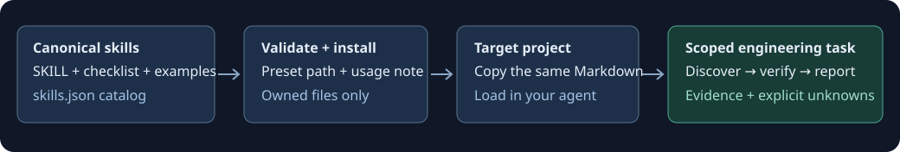

# AI Builder Skills Pack
## Give your coding agent a repeatable engineering workflow.

Evidence-first skills for Cursor, Codex, Claude Code and other AI coding agents — with a small, safe local installer.

**14 focused skills · One canonical source · No runtime dependencies · MIT licensed**

> “Use the security-auditor skill to audit this project's authentication and tenant isolation.”

The skill directs the agent to inspect the real repository, trace identity and resource access, gather evidence, rank confirmed findings and propose testable fixes. Missing access becomes an explicit verification gap, not an invented vulnerability.

**Status:** initial development release. Nothing has been published to npm by this setup. The intended package name is `ai-builder-skills`; availability and ownership must be checked before publication.

## Why this exists

A long prompt is easy to forget, drift or apply inconsistently. A useful skill preserves the decisions that matter: what to inspect, which boundaries to verify, when evidence is insufficient and how to know the work is done.

This pack provides concrete workflows, not promises that an agent will always be correct. For example, debugging follows reproduction → execution trace → falsifiable hypothesis → smallest fix → regression check. Database optimization requires a workload and query-plan evidence before recommending indexes.

## Available skills

| Skill | Focus |
| --- | --- |
| [`frontend-expert`](skills/frontend-expert/SKILL.md) | Build and repair frontend interactions using the existing component system, accessible states and real browser evidence. |
| [`nextjs-expert`](skills/nextjs-expert/SKILL.md) | Implement or debug Next.js routing, rendering, caching and server boundaries against the installed version. |
| [`backend-architect`](skills/backend-architect/SKILL.md) | Design service boundaries, durable jobs and failure handling from actual backend constraints and traffic evidence. |
| [`api-designer`](skills/api-designer/SKILL.md) | Design and review API contracts with explicit validation, resource authorization, compatibility and retry semantics. |
| [`database-optimizer`](skills/database-optimizer/SKILL.md) | Investigate slow queries and safe schema/index changes using real plans, workload shape and correctness constraints. |
| [`supabase-expert`](skills/supabase-expert/SKILL.md) | Review or implement Supabase Auth, database policies, Storage and server clients with explicit tenant isolation. |
| [`security-auditor`](skills/security-auditor/SKILL.md) | Audit application trust boundaries and report only evidence-backed security findings with prioritized, testable fixes. |
| [`debugging-expert`](skills/debugging-expert/SKILL.md) | Resolve reproducible bugs through evidence gathering, execution tracing, root-cause isolation and minimal regression-tested fixes. |
| [`ui-ux-reviewer`](skills/ui-ux-reviewer/SKILL.md) | Review concrete user journeys for usability, accessibility and visual hierarchy, separating observed friction from preferences. |
| [`performance-optimizer`](skills/performance-optimizer/SKILL.md) | Find measured application bottlenecks and validate focused optimizations under comparable workloads. |
| [`saas-architect`](skills/saas-architect/SKILL.md) | Design lean multi-tenant SaaS capabilities with explicit isolation, entitlements, billing state and operating-cost assumptions. |
| [`ai-rag-engineer`](skills/ai-rag-engineer/SKILL.md) | Build and evaluate retrieval-augmented generation with evidence quality, access filtering, provenance and cost controls. |
| [`code-reviewer`](skills/code-reviewer/SKILL.md) | Review a concrete diff for actionable correctness, security and compatibility regressions with precise evidence. |
| [`blender-3d-expert`](skills/blender-3d-expert/SKILL.md) | Plan and execute editable Blender workflows with scene inspection, real scale and measured web-export budgets. |

Each folder contains `SKILL.md`, `CHECKLIST.md` and `EXAMPLES.md`. The examples describe expected procedures; they do not pretend an imaginary project was audited.

## Installation

### From this checkout, today

Requires **Node.js 22+** and npm. Open a terminal in this folder, independently of any surrounding application:

```sh
npm ci
npm run check
npm run cli -- init
```

`init` prompts for a preset and one or more skill IDs or menu numbers. Choose comma- or space-separated entries, or `all`. The target defaults to the directory you ran the command from (for `npm run cli`, that is the directory where you invoked npm); use `--target` to select your application explicitly.

```sh
npm run cli -- init --target "../my-app"
npm run cli -- install security-auditor debugging-expert --preset codex --target "../my-app"
```

Only this pack needs development dependencies. The destination application gets Markdown files and installation receipts, not npm dependencies.

### After a verified npm release

The intended command is:

```sh
npx ai-builder-skills init
```

**Do not use that command to obtain this unpublished checkout.** Until the maintainer controls and publishes the package name, npm may fail or resolve an unrelated package. Use the local commands above.

## CLI usage

The examples below run from the pack root:

```sh
npm run cli -- list
npm run cli -- help
npm run cli -- init
npm run cli -- install security-auditor --target "../my-app"
npm run cli -- install frontend-expert nextjs-expert --preset cursor --target "../my-app"
npm run cli -- install --all --preset generic --target "../my-app"
npm run cli -- installed --target "../my-app"
npm run cli -- remove security-auditor --target "../my-app"
```

| Command/option | Behavior |
| --- | --- |
| `init` | Interactive preset and multi-skill selection; accepts explicit IDs/options for automation |
| `list` | Available skills from `skills.json` |
| `install <id...>` | Copy selected skills; `--all` installs the catalog |
| `installed` | Show owned installations, versions and edit status; scans all presets by default |
| `remove <id...>` | Remove named, owned skills; detects the preset, or asks for `--preset` if the skill is installed for several tools |
| `help`, `--help`, `-h` | Usage and options |
| `--preset <name>` | `generic`, `cursor`, `codex` or `claude`; `install` defaults to `generic` |
| `--target <path>` | Target project; defaults to the directory you ran the command from; quote paths containing spaces |
| `--force` | Explicitly replace managed installations or discard modified owned files during removal |

Noninteractive installation requires IDs or `--all`. Unknown flags, unknown IDs and missing arguments fail with a nonzero exit code.

### Your files stay yours

Existing skills are never overwritten by default. `--force` replaces only a valid managed installation and can discard local edits; back up changes first. Unknown directories, extra files and symbolic links are refused even with `--force`. Manually copied skills are not automatically adopted or removed.

Installations contain the three canonical files, a generated `USAGE.md`, and `.ai-builder-install.json` with file hashes. Keep the receipt if you want installer-managed listing/removal. No agent settings, `AGENTS.md`, `CLAUDE.md`, application dependencies or routes are edited.

A whole batch is not transactional. See [failure and recovery](docs/architecture.md#failure-and-recovery) for interruption and disk-error behavior.

## Manual usage

No CLI or paid API is required to read and use the skills.

1. Open a relevant `skills/<id>/SKILL.md`.
2. Attach or paste it into your agent's context with the specific task.
3. Include the companion checklist/examples when relevant. If copying files, keep all three together so relative links work.
4. Ask the agent to inspect the actual project and disclose checks it could not run.

Example request:

> Read skills/debugging-expert/SKILL.md. Diagnose the failed settings save. First reproduce the error and trace the actual request. Make the smallest safe fix and report real verification results.

The destination path may differ; name the actual copied file.

## Tool presets

| Preset | Project-local destination |
| --- | --- |
| Generic | `.ai-builder/skills/<id>/` |
| Cursor | `.cursor/skills/<id>/` |
| Codex | `.agents/skills/<id>/` |
| Claude Code | `.claude/skills/<id>/` |

These are conservative file-copy presets, not plugins, permission grants or guarantees of automatic loading. Generic is this project's convention. Tool-specific paths follow the official [Cursor skills documentation](https://cursor.com/docs/skills), [Codex skills documentation](https://developers.openai.com/codex/skills/) and [Claude Code skills documentation](https://code.claude.com/docs/en/skills), checked on October 5, 2026. Exact integration paths, invocation syntax and discovery behavior may evolve between versions. Explicitly loading the file remains the fallback.

### Cursor example

```sh
npm run cli -- install frontend-expert --preset cursor --target "../my-app"
```

In the target project's Cursor chat, attach `.cursor/skills/frontend-expert/SKILL.md` and ask:

> Use this skill to fix the settings form's loading and error states. Reuse our existing components and verify keyboard behavior.

See [the complete example](examples/cursor-example/README.md).

### Codex example

```sh
npm run cli -- install security-auditor --preset codex --target "../my-app"
```

In the target project's Codex chat:

> Read .agents/skills/security-auditor/SKILL.md and audit authentication and organization access. Report confirmed findings separately from unknowns. Do not make code changes in this audit.

See [the complete example](examples/codex-example/README.md).

### Claude Code example

```sh
npm run cli -- install debugging-expert --preset claude --target "../my-app"
```

In the target project's Claude Code session:

> Read .claude/skills/debugging-expert/SKILL.md. Reproduce the duplicate submission bug, trace the root cause and implement the smallest safe fix. State exactly which checks ran.

If your installed version discovers the skill, use its supported skill selector/invocation. This pack does not change tool permissions or force automatic invocation.

## How skills work



- **Discover:** read real project instructions, versions, code and tool availability.
- **Decide:** choose a workflow using explicit evidence and domain-specific decision rules.
- **Verify:** run relevant checks when available; separate facts, hypotheses and missing access.
- **Report:** provide prioritized, actionable output with a clear definition of done.

The agent still needs access to your project and appropriate tools. The Blender skill cannot create a scene without Blender access. The RAG skill cannot claim retrieval quality without evaluation data. A security checklist cannot certify an application.

## Repository structure

```text
ai-builder-skills-pack/
├── skills/                 # One source of truth; 14 folders, three files each
├── skills.json             # Versioned skill catalog
├── adapters/               # Four path configs and small usage templates
├── src/
│   ├── cli/                # Arguments and terminal interaction
│   └── core/               # Validation and safe filesystem operations
├── scripts/                # Catalog/content validation entry point
├── tests/                  # Real CLI and filesystem tests
├── docs/                   # Setup, authoring and architecture
├── examples/               # Copyable requests for target tools
└── .github/workflows/      # Windows/Linux, Node 22/24 checks
```

See [the complete source tree](docs/architecture.md#source-tree) and [getting started](docs/getting-started.md).

## Creating custom skills

Follow [Creating a skill](docs/creating-a-skill.md). Add a folder with the three required files, register it in `skills.json`, update the README table and run:

```sh
npm run validate
npm test
npm run test:package
```

No CLI code changes are needed for a new manifest entry. The current schema deliberately accepts only the three canonical Markdown files; executable helpers or extra resources require a reviewed schema/installer extension.

## Contributing

Read [CONTRIBUTING.md](CONTRIBUTING.md). Contributions should add a useful decision rule, a realistic behavior evaluation or a tested installer improvement. Keep canonical content out of adapters. Sensitive reports follow [SECURITY.md](SECURITY.md).

## Roadmap

- Add small, sanitized evaluation repositories to test whether agents follow evidence and scope constraints.
- Publish a tested compatibility matrix for specific agent versions.
- Add preview/diff support before updates, preserving user customizations.
- Add machine-readable CLI output and optional skill discovery filters.
- Verify package ownership, repository metadata and private reporting before the first npm release.

These are planned improvements, not shipped features. There are no adoption, benchmark or certification claims.

## License

[MIT](LICENSE).

